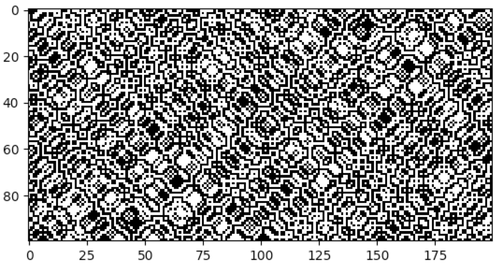
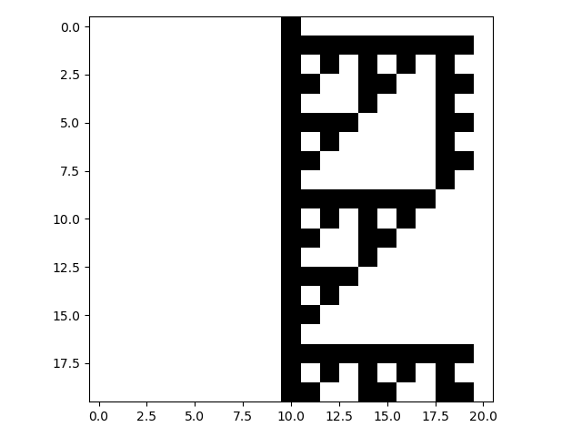
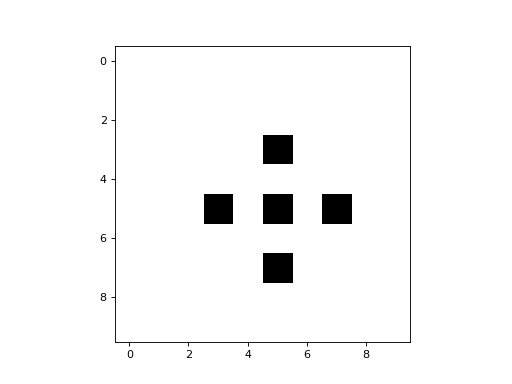

Additional Features
-------------------

Langton's Lambda
~~~~~~~~~~~~~~~~

One way to specify CA rules is with rule tables. Rule tables are enumerations of all possible neighbourhood states
together with their cell state mappings. For any given neighbourhood state, a rule table provides the associated cell
state value. CellPyLib provides a built-in function for creating random rule tables. The following snippet demonstrates
its usage:

.. code-block::

    import cellpylib as cpl

    rule_table, actual_lambda, quiescent_state = cpl.random_rule_table(lambda_val=0.45, k=4, r=2,
                                                                       strong_quiescence=True,
                                                                       isotropic=True)
    cellular_automaton = cpl.init_random(128, k=4)

    # use the built-in table_rule to use the generated rule table
    cellular_automaton = cpl.evolve(cellular_automaton, timesteps=200,
                                    apply_rule=lambda n, c, t: cpl.table_rule(n, rule_table), r=2)

The following plots demonstrate the effect of varying the lambda parameter:

.. image:: _static/phase_transition.png
    :width: 650

C. G. Langton describes the lambda parameter, and the transition from order to criticality to chaos in cellular
automata while varying the lambda parameter, in the paper:

.. code-block:: text

    Langton, C. G. (1990). Computation at the edge of chaos: phase transitions
    and emergent computation. Physica D: Nonlinear Phenomena, 42(1-3), 12-37.

Reversible CA
~~~~~~~~~~~~~

Elementary CA can be explicitly made to be reversible. CellPyLib has a class, `ReversibleRule`, which can be used to
decorate a rule, making it reversible. The following example demonstrates the creation of the elementary reversible CA
rule 90R:

.. code-block::

    import cellpylib as cpl

    cellular_automaton = cpl.init_random(200)
    r = cpl.ReversibleRule(cellular_automaton[0], 90)

    cellular_automaton = cpl.evolve(cellular_automaton, timesteps=100,
                                    apply_rule=r.apply_rule)

    cpl.plot(cellular_automaton)

Asynchronous CA
~~~~~~~~~~~~~~~

Typically, evolving a CA involves the synchronous updating of all the cells in a given timestep. However, it is also
possible to consider CA in which the cells are updated asynchronously. There are various schemes for achieving this.
`Wikipedia <https://en.wikipedia.org/wiki/Asynchronous_cellular_automaton>`_ has a page dedicated to this topic.

CellPyLib has a class, `AsynchronousRule`, which can be used to decorate a rule, making it asynchronous. In the
following example, the rule 60 sequential CA from the notes of `A New Kind of Science` (Chapter 9, section 10:
`Sequential cellular automata <http://www.wolframscience.com/nks/notes-9-10--sequential-cellular-automata/>`_) is
implemented:

.. code-block::

    import cellpylib as cpl

    cellular_automaton = cpl.init_simple(21)

    r = cpl.AsynchronousRule(apply_rule=lambda n, c, t: cpl.nks_rule(n, 60),
                             update_order=range(1, 20))

    cellular_automaton = cpl.evolve(cellular_automaton, timesteps=19*20,
                                    apply_rule=r.apply_rule)

    # get every 19th row, including the first, as a cycle is completed every 19 rows
    cpl.plot(cellular_automaton[::19])

CTRBL Rules
~~~~~~~~~~~

There exists a class of important CA that exhibit the property of self-reproduction. That is, there are patterns
observed that reproduce themselves during the evolution of these CA. This phenomenon has obvious relevance to the study
of Biological systems. These CA are typically 2-dimensional, with a von Neumann neighbourhood of radius 1. The
convention when specifying the rules for these CA is to enumerate the rule table using the states of the center (C), top
(T), right (R), bottom (B), and left (L) cells in the von Neumann neighbourhood.

Such CTRBL CA are supported in CellPyLib, through the `CTRBLRule` class. A particularly well-known CA in this class is
Langton's Loop. CellPyLib has a built-in implementation of this CA, available through the `LangtonsLoop` class.

Here is a simple example of a 2D CA that uses a CTRBL rule:

.. code-block::

    import cellpylib as cpl

    ctrbl = cpl.CTRBLRule(rule_table={
        (0, 1, 0, 0, 0): 1,
        (1, 1, 0, 0, 0): 0,
        (0, 0, 0, 0, 0): 0,
        (1, 0, 0, 0, 0): 1,
        (0, 0, 1, 1, 0): 0,
        (1, 1, 1, 1, 1): 1,
        (0, 1, 0, 1, 0): 0,
        (1, 1, 1, 0, 1): 1,
        (1, 0, 1, 0, 1): 1,
        (0, 1, 1, 1, 1): 1,
        (0, 0, 1, 1, 1): 0,
        (1, 1, 0, 0, 1): 1
    }, add_rotations=True)

    cellular_automaton = cpl.init_simple2d(rows=10, cols=10)

    cellular_automaton = cpl.evolve2d(cellular_automaton, timesteps=60,
                                      apply_rule=ctrbl.rule, neighbourhood="von Neumann")

    cpl.plot2d_animate(cellular_automaton)

It is a binary CA that always appears to evolve to some stable attractor state.