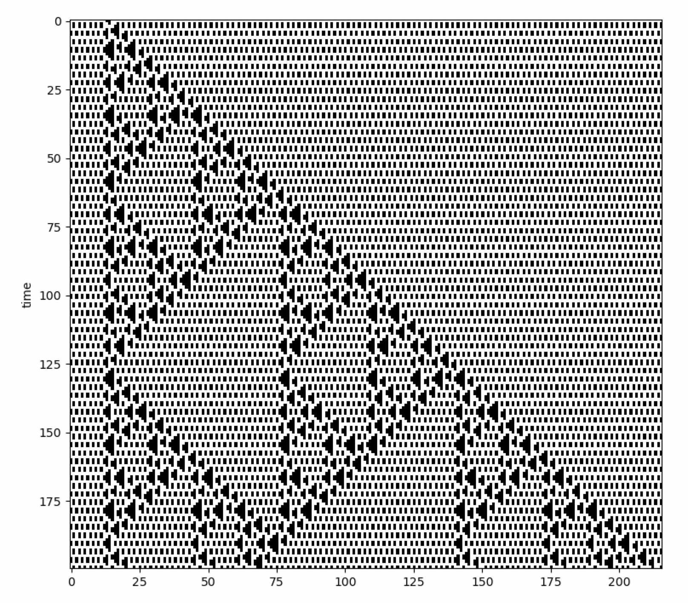
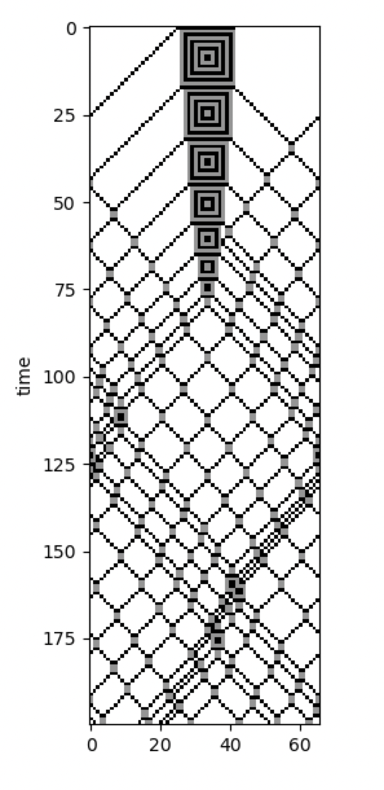

Block CA and The Second Law
---------------------------

In a typical CA, each cell is processed one-by-one, taking into account its surrounding neighbourhood cells. However, in
Block CA, the cells are processed in groups known as blocks. The rules of Block CA do not act on a single cell, but
rather act on each block of cells as a whole. With this format, it becomes easier to set up rules which are reversible
and which conserve quantities, such as cell colors. This makes Block CA useful for emulating physical systems.

Below is an example of a Block CA implemented with CellPyLib, which makes use of the built-in function
:py:func:`~cellpylib.ca_functions.evolve_block`. This CA was taken from Stephen Wolfram's book `A New Kind of Science`,
on page 460:

.. code-block::

    import cellpylib as cpl
    import numpy as np

    initial_conditions = np.array([[0]*13 + [1]*2 + [0]*201])

    def block_rule(n, t):
        if n == (1, 1): return 1, 1
        elif n == (1, 0): return 1, 0
        elif n == (0, 1): return 0, 0
        elif n == (0, 0): return 0, 1

    ca = cpl.evolve_block(initial_conditions, block_size=2,
                          timesteps=200, apply_rule=block_rule)

    cpl.plot(ca)

Block CA can be comprised of more than two colors, as the following example demonstrates, taken from Stephen Wolfram's
book `A New Kind of Science`, on the bottom of page 462:

.. code-block::

    import cellpylib as cpl
    import numpy as np

    initial_conditions = np.array([[0]*30 + [2]*30 + [0]*30])

    def block_rule(n, t):
        if   n == (1, 1): return 1, 1
        elif n == (1, 0): return 0, 2
        elif n == (0, 1): return 2, 0
        elif n == (0, 0): return 0, 0
        elif n == (2, 2): return 2, 2
        elif n == (2, 0): return 1, 0
        elif n == (0, 2): return 0, 1
        elif n == (2, 1): return 2, 1
        elif n == (1, 2): return 1, 2

    ca = cpl.evolve_block(initial_conditions, block_size=2,
                          timesteps=4500, apply_rule=block_rule)

    cpl.plot(ca[-500:])

.. image:: _static/block_ca_1d_2.png
    :width: 200
    :align: center

The Second Law
~~~~~~~~~~~~~~

In a series of `articles <https://writings.stephenwolfram.com/2023/02/computational-foundations-for-the-second-law-of-thermodynamics/>`_,
Stephen Wolfram shared his thoughts on the computational origins of the Second Law of
Thermodynamics. In the first part of the series, he illustrates his ideas with a number of different Block CA, such as
the one shown here:

The code for this Block CA is given below:

.. code-block::

    import cellpylib as cpl
    import numpy as np

    initial_conditions = np.array([[0]*25 + [2]*17 + [0]*24])

    def block_rule(n, t):
        if   n == (1, 1): return 2, 2
        elif n == (1, 0): return 1, 0
        elif n == (0, 1): return 0, 1
        elif n == (0, 0): return 0, 0
        elif n == (2, 2): return 1, 1
        elif n == (2, 0): return 0, 2
        elif n == (0, 2): return 2, 0
        elif n == (2, 1): return 2, 1
        elif n == (1, 2): return 1, 2

    ca = cpl.evolve_block(initial_conditions, block_size=2,
                          timesteps=200, apply_rule=block_rule)

    cpl.plot(ca)

Simple cellular automata systems with reversible and color-conserving rules give rise to the same "randomization"
seen in physical systems consisting of diffusing particles, as this "gas-like" 2D Block CA demonstrates:

.. image:: _static/block_ca_2d.gif
    :width: 500
    :align: center

The code for this 2D Block CA is given below:

.. code-block::

    import cellpylib as cpl
    import numpy as np

    # visit https://github.com/lantunes/cellpylib/tree/master/demos
    #  for the initial conditions file
    initial_conditions = np.loadtxt('block2d_rotated_initial_conditions.txt', dtype=int)
    initial_conditions = np.array([initial_conditions])

    def make_block2d_rule():
        base_rules = {
            ((0, 0), (0, 0)): ((0, 0), (0, 0)),
            ((0, 0), (0, 2)): ((2, 0), (0, 0)),
            ((2, 0), (0, 0)): ((0, 0), (0, 2)),
            ((0, 0), (2, 0)): ((0, 2), (0, 0)),
            ((0, 2), (0, 0)): ((0, 0), (2, 0)),
            ((0, 0), (2, 2)): ((2, 2), (0, 0)),
            ((2, 2), (0, 0)): ((0, 0), (2, 2)),
            ((0, 2), (0, 2)): ((2, 0), (2, 0)),
            ((2, 0), (2, 0)): ((0, 2), (0, 2)),
            ((0, 2), (2, 0)): ((2, 0), (0, 2)),
            ((2, 0), (0, 2)): ((0, 2), (2, 0)),
            ((0, 2), (2, 2)): ((2, 2), (2, 0)),
            ((2, 2), (2, 0)): ((0, 2), (2, 2)),
            ((2, 0), (2, 2)): ((2, 2), (0, 2)),
            ((2, 2), (0, 2)): ((2, 0), (2, 2)),
            ((2, 2), (2, 2)): ((2, 2), (2, 2)),
            # wall rules
            ((0, 0), (1, 1)): ((0, 0), (1, 1)),
            ((0, 1), (1, 1)): ((0, 1), (1, 1)),
            ((0, 2), (1, 1)): ((2, 0), (1, 1)),
            ((2, 0), (1, 1)): ((0, 2), (1, 1)),
            ((2, 1), (1, 1)): ((2, 1), (1, 1)),
            ((2, 2), (1, 1)): ((2, 2), (1, 1)),
            ((1, 1), (1, 1)): ((1, 1), (1, 1)),
            ((1, 0), (0, 0)): ((1, 0), (0, 0)),
            ((1, 0), (0, 2)): ((1, 0), (0, 2)),
        }
        rules = {}
        # add rotations
        for r, v in base_rules.items():
            rules[r] = v
            for _ in range(3):
                r = ((r[1][0], r[0][0]), (r[1][1], r[0][1]))
                v = ((v[1][0], v[0][0]), (v[1][1], v[0][1]))
                if r not in rules:
                    rules[r] = v
        def _apply_rule(n, t):
            n = tuple(tuple(i) for i in n)
            return rules[n]
        return _apply_rule

    ca = cpl.evolve2d_block(initial_conditions, block_size=(2, 2),
                            timesteps=251, apply_rule=make_block2d_rule())

    cpl.plot2d_animate(ca)

**References:**

https://en.wikipedia.org/wiki/Block_cellular_automaton

https://www.wolframscience.com/nks/p459--conserved-quantities-and-continuum-phenomena/

https://writings.stephenwolfram.com/2023/02/computational-foundations-for-the-second-law-of-thermodynamics/
