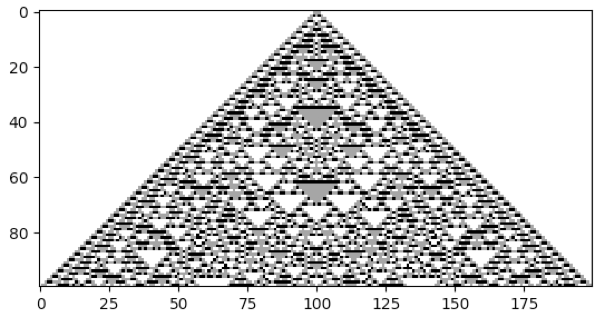

Varying the Number of Colors
----------------------------

The number of states, or colors, that a cell can adopt is given by `k`. For example, a binary cellular automaton, in
which a cell can assume only values of 0 and 1, has `k = 2`. CellPyLib supports any value of `k`. A built-in function,
:py:func:`~cellpylib.ca_functions.totalistic_rule`, is an implementation of the Totalistic cellular automaton rule, as
described in Stephen Wolfram's `A New Kind of Science`. The code snippet below illustrates using this rule. A value of
`k` of 3 is used, but any value between (and including) 2 and 36 is currently supported. The rule number is given in
base 10 but is interpreted as the rule in base `k` (thus rule 777 corresponds to '1001210' when `k = 3`).

.. code-block::

    import cellpylib as cpl

    cellular_automaton = cpl.init_simple(200)

    # evolve the CA, using totalistic rule 777 for a 3-color CA
    cellular_automaton = cpl.evolve(cellular_automaton, timesteps=100,
                                    apply_rule=lambda n, c, t: cpl.totalistic_rule(n, k=3, rule=777))

    cpl.plot(cellular_automaton)

**References:**

*Wolfram, S. (2002). A New Kind of Science. Champaign, IL: Wolfram Media.*
