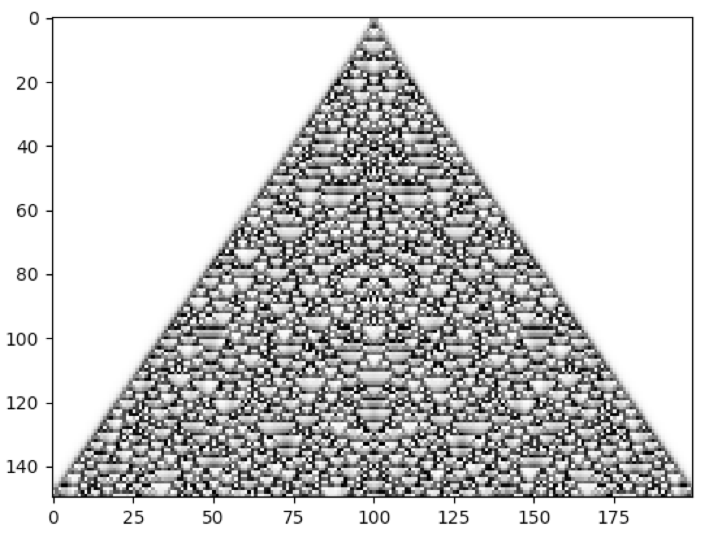

Continuous CA
-------------

Cellular Automata needn't consist of discrete activities. The units in an automaton can also take on continuous-valued
activities (i.e. states).

The example below implements a continuous-valued Cellular Automaton from Stephen Wolfram's book `A New Kind of Science`,
found on page 157:

.. code-block::

    import math
    import numpy as np
    import cellpylib as cpl

    cellular_automaton = cpl.init_simple(200, dtype=np.float64)

    def apply_rule(n, c, t):
        result = (sum(n) / len(n)) * (3 / 2)
        frac, whole = math.modf(result)
        return frac

    cellular_automaton = cpl.evolve(cellular_automaton, timesteps=150,
                                    apply_rule=apply_rule)

    cpl.plot(cellular_automaton)

**References:**

*Wolfram, S. (2002). A New Kind of Science (page 157). Champaign, IL: Wolfram Media.*
