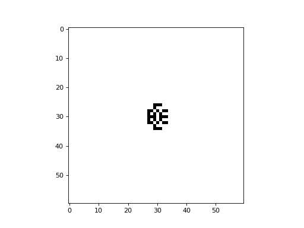
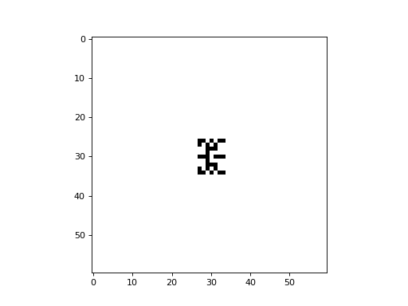
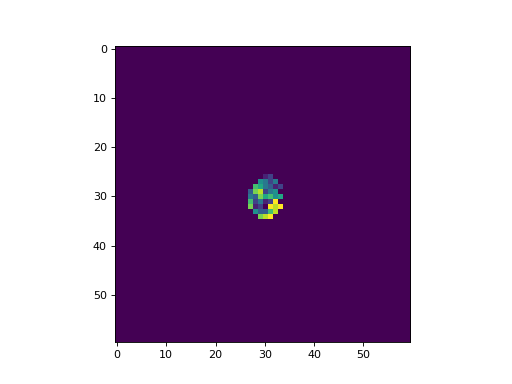

Fredkin's Self-Replicating CA
-----------------------------

Ed Fredkin described an interesting cellular automaton that exhibits self-replication. The CA is 2-dimensional, and can
consist of two or more colors. To compute the state of a cell at the next timestep, one sums the states of the
neighbouring cells, modulo `p`, where `p` represents the number of colors. The neighborhood can be either of the Moore
or von Neumann type. As the CA evolves, copies of the initial configuration will be produced. The examples below of
these CA are based on John D. Cook's blog posts,
`here <https://www.johndcook.com/blog/2021/05/03/self-reproducing-cellular-automata/>`_ and
`here <https://www.johndcook.com/blog/2021/05/03/multicolor-reproducing-ca/>`_:

The following is an example of the Fredkin self-replicating CA with a von Neumann neighborhood, implemented with
CellPyLib:

.. code-block::

    import cellpylib as cpl
    import numpy as np

    cellular_automaton = cpl.init_simple2d(60, 60)
    # the letter "E"
    cellular_automaton[0][28][28] = 1
    cellular_automaton[0][28][29] = 1
    cellular_automaton[0][28][30] = 1
    cellular_automaton[0][29][28] = 1
    cellular_automaton[0][30][28] = 1
    cellular_automaton[0][30][29] = 1
    cellular_automaton[0][30][30] = 1
    cellular_automaton[0][31][28] = 1
    cellular_automaton[0][32][28] = 1
    cellular_automaton[0][32][29] = 1
    cellular_automaton[0][32][30] = 1

    def activity_rule(n, c, t):
        current_activity = n[1][1]
        return (np.sum(n) - current_activity) % 2

    cellular_automaton = cpl.evolve2d(cellular_automaton, timesteps=20,
                                      apply_rule=activity_rule, neighbourhood="von Neumann")

    cpl.plot2d_animate(cellular_automaton, interval=350)

The following is an example of the Fredkin self-replicating CA with a Moore neighborhood, implemented with CellPyLib:

.. code-block::

    import cellpylib as cpl
    import numpy as np

    cellular_automaton = cpl.init_simple2d(60, 60)
    # the letter "E"
    cellular_automaton[0][28][28] = 1
    cellular_automaton[0][28][29] = 1
    cellular_automaton[0][28][30] = 1
    cellular_automaton[0][29][28] = 1
    cellular_automaton[0][30][28] = 1
    cellular_automaton[0][30][29] = 1
    cellular_automaton[0][30][30] = 1
    cellular_automaton[0][31][28] = 1
    cellular_automaton[0][32][28] = 1
    cellular_automaton[0][32][29] = 1
    cellular_automaton[0][32][30] = 1

    def activity_rule(n, c, t):
        current_activity = n[1][1]
        return (np.sum(n) - current_activity) % 2

    cellular_automaton = cpl.evolve2d(cellular_automaton, timesteps=20,
                                      apply_rule=activity_rule, neighbourhood="Moore")

    cpl.plot2d_animate(cellular_automaton, interval=350)

The following is an example of the Fredkin self-replicating multi-color CA with a von Neumann neighborhood, implemented
with CellPyLib:

.. code-block::

    import cellpylib as cpl
    import numpy as np

    cellular_automaton = cpl.init_simple2d(60, 60)
    # the letter "E"
    cellular_automaton[0][28][28] = 0
    cellular_automaton[0][28][29] = 1
    cellular_automaton[0][28][30] = 2
    cellular_automaton[0][29][28] = 3
    cellular_automaton[0][30][28] = 4
    cellular_automaton[0][30][29] = 5
    cellular_automaton[0][30][30] = 6
    cellular_automaton[0][31][28] = 7
    cellular_automaton[0][32][28] = 8
    cellular_automaton[0][32][29] = 9
    cellular_automaton[0][32][30] = 10

    def activity_rule(n, c, t):
        current_activity = n[1][1]
        return (np.sum(n) - current_activity) % 11

    cellular_automaton = cpl.evolve2d(cellular_automaton, timesteps=23,
                                      apply_rule=activity_rule, neighbourhood="von Neumann")

    cpl.plot2d_animate(cellular_automaton, interval=350, colormap="viridis")

**References:**

*Edwin R. Banks, Information Processing and Transmission in Cellular Automata. MIT dissertation. January 1971.*

https://www.johndcook.com/blog/2021/05/03/self-reproducing-cellular-automata/

https://www.johndcook.com/blog/2021/05/03/multicolor-reproducing-ca/
