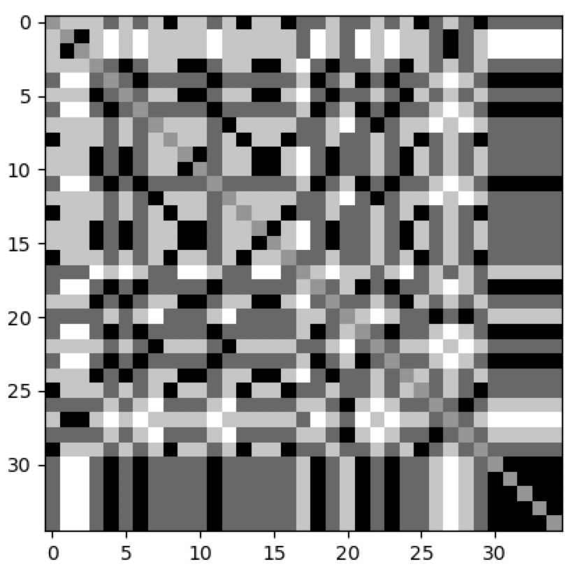
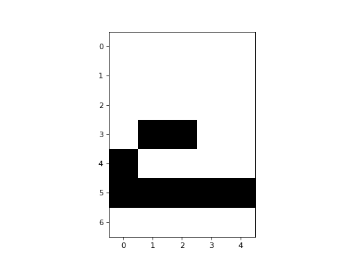

Hopfield Network
----------------

The Hopfield Network can be thought of as a cellular automaton where all cells are neighbours of eachother. The cells
(or neurons) are binary units, and the activity rule is a simple threshold rule, where the weighted inputs to a cell are
summed and compared to a threshold value. The weights are learned from the training data.

CellPyLib includes a built-in implementation of a Hopfield Network, in the
:py:class:`~cellpylib.hopfield_net.HopfieldNet` class, based on the idea that the Hopfield Network can be viewed as a
kind of cellular automaton.

To use it, we must first train the network, by giving it a set of patterns:

.. code-block::

    import cellpylib as cpl
    import numpy as np

    hopfield_net = cpl.HopfieldNet(num_cells=35)

    zero = [
        0, 1, 1, 1, 0,
        1, 0, 0, 0, 1,
        1, 0, 0, 0, 1,
        1, 0, 0, 0, 1,
        1, 0, 0, 0, 1,
        0, 1, 1, 1, 0,
        0, 0, 0, 0, 0]
    one = [
        0, 1, 1, 0, 0,
        0, 0, 1, 0, 0,
        0, 0, 1, 0, 0,
        0, 0, 1, 0, 0,
        0, 0, 1, 0, 0,
        0, 0, 1, 0, 0,
        0, 0, 0, 0, 0]
    two = [
        1, 1, 1, 0, 0,
        0, 0, 0, 1, 0,
        0, 0, 0, 1, 0,
        0, 1, 1, 0, 0,
        1, 0, 0, 0, 0,
        1, 1, 1, 1, 1,
        0, 0, 0, 0, 0]
    # replace the zeroes with -1 to make these vectors bipolar instead of binary
    one = [-1 if x == 0 else x for x in one]
    two = [-1 if x == 0 else x for x in two]
    zero = [-1 if x == 0 else x for x in zero]

    P = [zero, one, two]

    hopfield_net.train(P)

As shown above, we must instantiate an instance of a :py:class:`~cellpylib.hopfield_net.HopfieldNet`, specifying the
number of cells. Then, we must call :py:func:`~cellpylib.hopfield_net.HopfieldNet.train`, providing a list of training
examples. *NOTE: Only Hopfield Networks with an odd number of cells is currently supported due to limitations of the
implementation.*

Using the :py:class:`~cellpylib.hopfield_net.HopfieldNet` involves providing a potentially incomplete pattern, and
evolving the network for a pre-specified number of timesteps. The network state should settle into a pattern that
resembles those seen during training. It acts like a content-addressable (associative) memory.

.. code-block::

    half_two = [
        0, 0, 0, 0, 0,
        0, 0, 0, 0, 0,
        0, 0, 0, 0, 0,
        0, 1, 1, 0, 0,
        1, 0, 0, 0, 0,
        1, 1, 1, 1, 1,
        0, 0, 0, 0, 0]
    half_two = [-1 if x == 0 else x for x in half_two]

    cellular_automaton = np.array([half_two])

    cellular_automaton = cpl.evolve(cellular_automaton, timesteps=155,
                                    apply_rule=hopfield_net.apply_rule, r=hopfield_net.r)

    cpl.plot(hopfield_net.W)
    cpl.plot2d_animate(np.reshape(cellular_automaton, (155, 7, 5)))

**References:**

*J. J. Hopfield, "Neural networks and physical systems with emergent collective computational abilities",
Proceedings of the National Academy of Sciences of the USA, vol. 79 no. 8 pp. 2554–2558, April 1982.*

https://en.wikipedia.org/wiki/Hopfield_network

http://neupy.com/2015/09/20/discrete_hopfield_network.html
