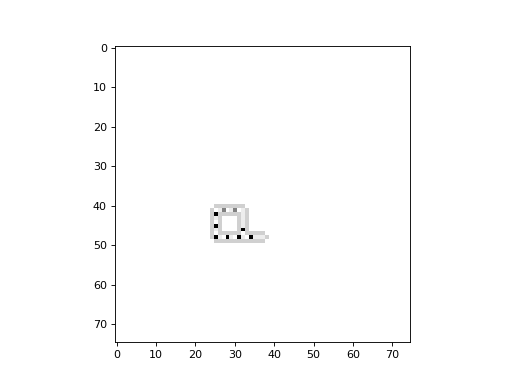

Langton's Loops
---------------

In 1984, Christopher Langton described a type of 2-dimensional cellular automaton that exhibits a self-replicating
dynamic loop structure. A branch of Artificial Life research developed from this work, resulting in better insight into
self-replicating processes, which has obvious relevance to Biology and living systems.

Below is an example of Langton's loop. This example makes use of the `LangtonsLoop` class, which is an extension of the
`CTRBLRule` class, which can be used for constructing any kind of rule based on a von Neumann neighbourhood which
considers the Center, Top, Right, Bottom and Left cells explicitly.

.. code-block::

    import cellpylib as cpl

    langtons_loop = cpl.LangtonsLoop()

    # the initial conditions consist of a single loop
    cellular_automaton = langtons_loop.init_loops(1, (75, 75), [40], [25])

    cellular_automaton = cpl.evolve2d(cellular_automaton, timesteps=500,
                                      apply_rule=langtons_loop)

    cpl.plot2d_animate(cellular_automaton)

**References:**

*Langton, C. G. (1984). Self-reproduction in Cellular Automata. Physica D: Nonlinear Phenomena, 10(1-2), 135-144.*

https://en.wikipedia.org/wiki/Langton%27s_loops
