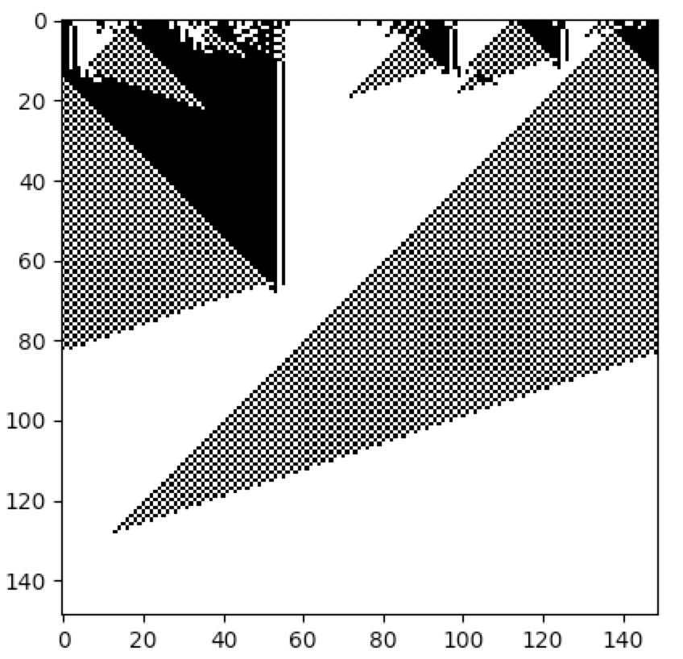

Varying the Neighbourhood Size
------------------------------

The size of the cell neighbourhood can be varied by setting the parameter ``r`` when calling the
:py:func:`~cellpylib.ca_functions.evolve` function. The value of ``r`` represents the number of cells to the left and
to the right of the cell under consideration. Thus, to get a neighbourhood size of 3, ``r`` should be 1, and to get a
neighbourhood size of 7, ``r`` should be 3. As an example, consider the work of M. Mitchell et al. involving the
creation (discovery) of a cellular automaton that solves the density classification problem: if the initial random
binary vector contains more than 50% of 1s, then a cellular automaton that solves this problem will give rise to a
vector that contains only 1s after a fixed number of time steps, and likewise for the case of 0s. A very effective
cellular automaton that solves this problem most of the time was found using a Genetic Algorithm.

.. code-block::

    import cellpylib as cpl

    cellular_automaton = cpl.init_random(149)

    # Mitchell et al. discovered this rule using a Genetic Algorithm
    rule_number = 6667021275756174439087127638698866559

    # evolve the CA, setting r to 3, for a neighbourhood size of 7
    cellular_automaton = cpl.evolve(cellular_automaton, timesteps=149,
                                    apply_rule=lambda n, c, t: cpl.binary_rule(n, rule_number),
                                    r=3)

    cpl.plot(cellular_automaton)

**References:**

*Melanie Mitchell, James P. Crutchfield, and Rajarshi Das, "Evolving Cellular Automata with Genetic Algorithms:
A Review of Recent Work", In Proceedings of the First International Conference on Evolutionary Computation and Its
Applications (EvCA'96), Russian Academy of Sciences (1996).*