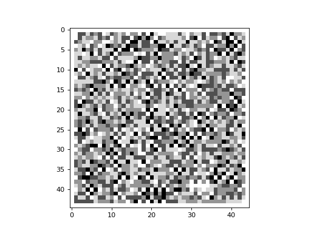
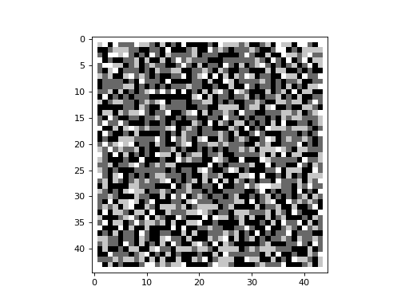
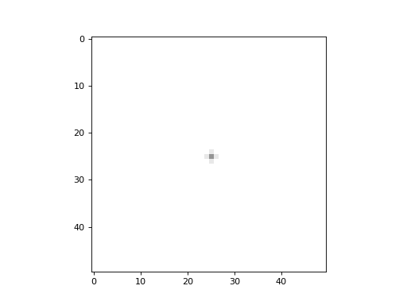

Sandpiles
---------

A sandpile is a cellular automaton and dynamical system that displays self-organized criticality. It was introduced by
Bak, Tang and Wiesenfeld in 1987.

Below is an example of a sandpile using the built-in :py:class:`~cellpylib.sandpile.Sandpile` class. The boundary of
the 2D CA can be either closed or open. If the boundary is closed, then all boundary cells should have a value of 0.

.. code-block::

    import cellpylib as cpl
    import numpy as np

    n_rows = 45
    n_cols = 45
    sandpile = cpl.Sandpile(n_rows, n_cols)

    ca = np.random.randint(5, size=n_rows*n_cols).reshape((1, n_rows, n_cols))
    # we're using a closed boundary, so make the boundary cells 0
    ca[0, 0, :], ca[0, n_rows-1, :], ca[0, :, 0], ca[0, :, n_cols-1] = 0, 0, 0, 0

    ca = cpl.evolve2d(ca, timesteps=50, apply_rule=sandpile, neighbourhood="von Neumann")

    cpl.plot2d_animate(ca)

Note that in the example above, the number of timesteps is fixed at `50`. However, for any random initial conditions, it
isn't obvious how many timesteps are necessary for the system to reach a stable state, or fixed point, in its evolution.
The library provides a function, :py:func:`~cellpylib.ca_functions.until_fixed_point`, that can be called to provide a
callable for the ``timesteps`` argument of the :py:func:`~cellpylib.ca_functions2d.evolve2d` function. By calling this
function, instead of providing a fixed number, the sandpile will evolve until there is no further change in the state of
the system. Below is an example demonstrating this:

.. code-block::

    import cellpylib as cpl
    import numpy as np
    np.random.seed(0)

    n_rows = 45
    n_cols = 45
    sandpile = cpl.Sandpile(n_rows, n_cols)

    initial = np.random.randint(5, size=n_rows*n_cols).reshape((1, n_rows, n_cols))
    # we're using a closed boundary, so make the boundary cells 0
    initial[0, 0, :], initial[0, n_rows-1, :], initial[0, :, 0], initial[0, :, n_cols-1] = 0, 0, 0, 0

    ca = cpl.evolve2d(initial, timesteps=cpl.until_fixed_point(),
                      apply_rule=sandpile, neighbourhood="von Neumann")

    print("Number of timesteps to reach fixed point: %s" % len(ca))
    cpl.plot2d_animate(ca)

The above program will print out the following:

.. code-block::

    Number of timesteps to reach fixed point: 51

If one perturbs a sandpile that has reached a fixed point in its evolution, then the sandpile should reconfigure itself
and eventually reach a fixed point once again. This can be demonstrated using the
:py:func:`~cellpylib.sandpile.Sandpile.add_grain` function of the :py:class:`~cellpylib.sandpile.Sandpile` class. In the
example below, we begin with a sandpile that has reached a fixed point (this configuration is assumed to exist in a file
called `sandpile_add_grain_demo.txt`, located in the same directory as the program). We drop a grain of sand on the cell
located at row with index `23` and column with index `23` at timestep `1`.

.. code-block::

    import cellpylib as cpl
    import numpy as np

    n_rows = 45
    n_cols = 45
    sandpile = cpl.Sandpile(n_rows, n_cols)
    sandpile.add_grain(cell_index=(23, 23), timestep=1)

    initial = np.loadtxt('sandpile_add_grain_demo.txt', dtype=int)
    initial = np.array([initial])

    ca = cpl.evolve2d(initial, timesteps=cpl.until_fixed_point(),
                      apply_rule=sandpile, neighbourhood="von Neumann")

    print("Number of timesteps to reach fixed point: %s" % len(ca))
    cpl.plot2d_animate(ca)

Imagine dropping a single grain of sand repeatedly on the same cell in the center of a grid, allowing the sandpile to
attain a stable state (i.e. fixed point) before dropping the next grain. This can be demonstrated with the following
code snippet:

.. code-block::

    import cellpylib as cpl

    n = 50
    sandpile = cpl.Sandpile(n, n)
    ca = cpl.init_simple2d(n, n, val=5)

    for i in range(300):
        ca[-1, n//2, n//2] += 1
        ca = cpl.evolve2d(ca, apply_rule=sandpile,
                          timesteps=cpl.until_fixed_point(), neighbourhood='Moore')

    cpl.plot2d_animate(ca)

Above, we take advantage of the fact that the `ca` argument to :py:func:`~cellpylib.ca_functions2d.evolve2d` can
contain a history of prior states, and that the evolution continues from the last state.

**References:**

*Bak, Per, Chao Tang, and Kurt Wiesenfeld. "Self-organized criticality." Physical review A 38.1 (1988): 364.*

https://en.wikipedia.org/wiki/Abelian_sandpile_model
