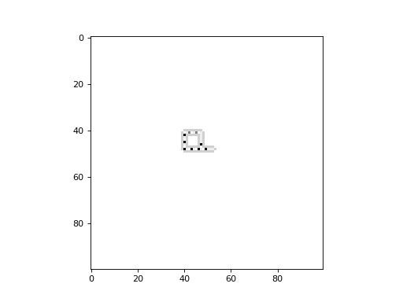
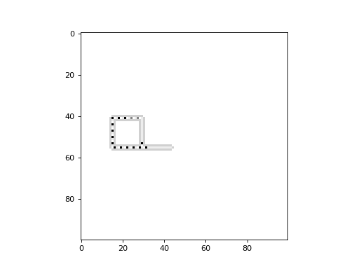

Sayama's SDSR Loop and Evoloop
------------------------------

In 1998, as a successor to Langton's Loop, Hiroki Sayama introduced the structurally dissolvable self-reproducing (SDSR)
loop. Structural dissolution represents a form of death for a loop, and the potential for individual loops to replace
others exists. This property introduces an intriguing dynamic behaviour with the potential for evolution.

Below is an example of the SDSR loop. This example makes use of the :py:class:`~cellpylib.sdsr_loop.SDSRLoop` class,
which is an extension of the :py:class:`~cellpylib.langtons_loop.LangtonsLoop` class, which can be used for
constructing any kind of rule based on a von Neumann neighbourhood which considers the Center, Top, Right, Bottom and
Left cells explicitly.

.. code-block::

    import cellpylib as cpl

    sdsr_loop = cpl.SDSRLoop()

    # the initial conditions consist of a single loop
    cellular_automaton = sdsr_loop.init_loops(1, (100, 100), [40], [40])

    cellular_automaton = cpl.evolve2d(cellular_automaton, timesteps=700,
                                      apply_rule=sdsr_loop, memoize=True)

    cpl.plot2d_animate(cellular_automaton)

While the potential for evolution exists with the SDSR loop, it is the Evoloop which truly exhibits it. Also introduced
by H. Sayama, the Evoloop is an SDSR loop with various phenotypes, that interact and compete with each other for space.

Below is an example of the Evoloop. This example makes use of the :py:class:`~cellpylib.evoloop.Evoloop` class,
which is an extension of the :py:class:`~cellpylib.ctrbl_rule.CTRBLRule` class, which can be used for constructing any
kind of rule based on a von Neumann neighbourhood which considers the Center, Top, Right, Bottom and Left cells
explicitly.

.. code-block::

    import cellpylib as cpl

    evoloop = cpl.Evoloop()

    # the initial conditions consist of a single loop
    cellular_automaton = evoloop.init_species13_loop((100, 100), 40, 15)

    cellular_automaton = cpl.evolve2d(cellular_automaton, timesteps=700,
                                      apply_rule=evoloop, memoize=True)

    cpl.plot2d_animate(cellular_automaton)

**References**

*Sayama, H. (1998). Constructing evolutionary systems on a simple deterministic cellular automata space.
PhD, University of Tokyo, Department of Information Science.*

*Sayama, H. (1998, August). Introduction of structural dissolution into Langton's self-reproducing loop.
In Proceedings of the sixth international conference on Artificial life (pp. 114-122).*

*Sayama, H. (1999). A new structurally dissolvable self-reproducing loop evolving in a simple cellular automata space.
Artificial Life, 5(4), 343-365.*