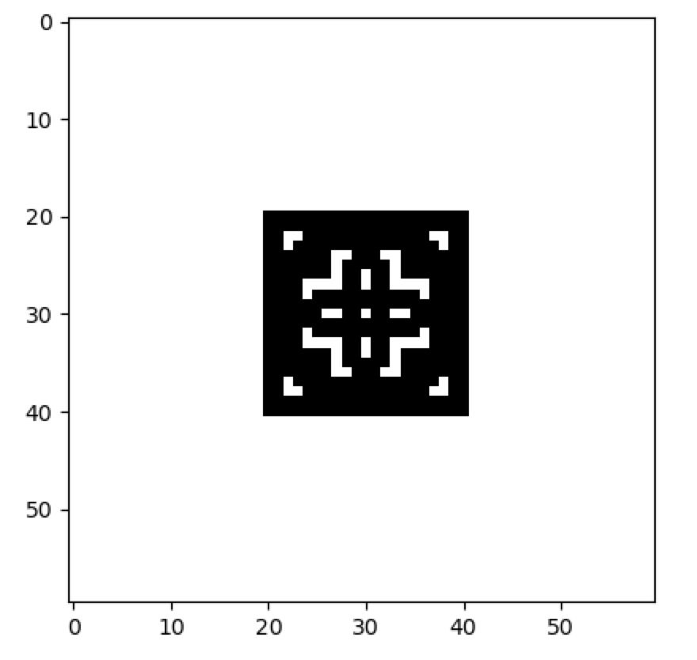
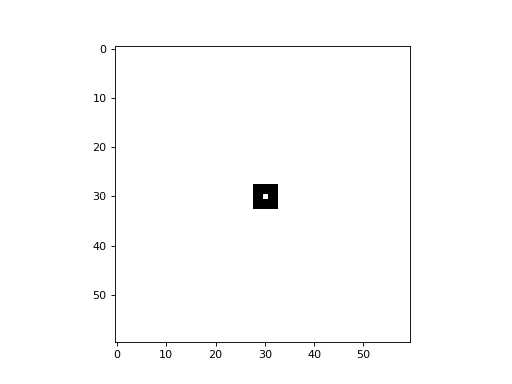

Two-Dimensional CA
------------------

CellPyLib supports 2-dimensional cellular automata with periodic boundary conditions. The number of states, `k`, can be
any whole number. The neighbourhood radius, `r`, can also be any whole number, and both Moore and von Neumann
neighbourhood types are supported. The following snippet demonstrates creating a 2D totalistic cellular automaton:

.. code-block::

    import cellpylib as cpl

    # initialize a 60x60 2D cellular automaton
    cellular_automaton = cpl.init_simple2d(60, 60)

    # evolve the cellular automaton for 30 time steps,
    #  applying totalistic rule 126 to each cell with a Moore neighbourhood
    cellular_automaton = cpl.evolve2d(cellular_automaton, timesteps=30, neighbourhood='Moore',
                                      apply_rule=lambda n, c, t: cpl.totalistic_rule(n, k=2, rule=126))

    cpl.plot2d(cellular_automaton)

.. image:: _static/tot_rule126_2d_moore.png
    :width: 250

The image above represents the state at the final timestep. However, the state of the CA at any timestep can be
visualized using the :py:class:`~cellpylib.ca_functions2d.plot2d` ``timestep`` argument. For example, in the code
snippet below, the state at the 10th timestep is plotted:

.. code-block::

    cpl.plot2d(cellular_automaton, timestep=10)

Note that 2D CA can also be animated, so that the entire evolution of the CA can be visualized, using the
:py:class:`~cellpylib.ca_functions2d.plot2d_animate` function:

.. code-block::

    cpl.plot2d_animate(cellular_automaton)

