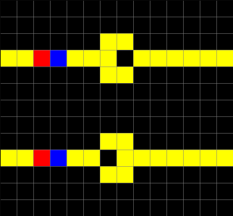
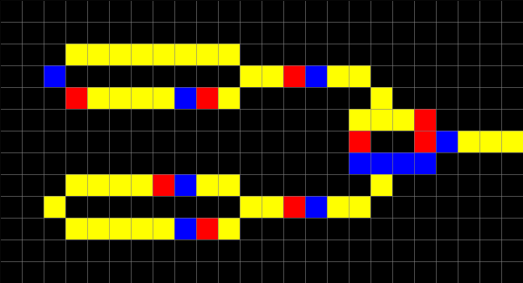

Wireworld
---------

Wireworld is a Turing-complete Cellular Automaton, first described by Brian Silverman in 1987. Wireworld can be used to
simulate electronic gates, or logic elements.

An example of Wireworld diodes, implemented with CellPyLib, is given below:

.. code-block::

    import cellpylib as cpl
    import numpy as np
    from matplotlib.colors import ListedColormap

    def wireworld_rule(n, c, t):
        current_activity = n[1][1]
        if current_activity == 0:  # empty
            return 0
        if current_activity == 1:  # electron head
            return 2
        if current_activity == 2:  # electron tail
            return 3
        if current_activity == 3:  # conductor
            electron_head_count = np.count_nonzero(n == 1)
            return 1 if electron_head_count == 1 or electron_head_count == 2 else 3

    cellular_automata = np.array([[
        [0, 0, 0, 0, 0, 0, 0, 0, 0, 0, 0, 0, 0, 0],
        [0, 0, 0, 0, 0, 0, 0, 0, 0, 0, 0, 0, 0, 0],
        [0, 0, 0, 0, 0, 0, 3, 3, 0, 0, 0, 0, 0, 0],
        [2, 1, 3, 3, 3, 3, 3, 0, 3, 3, 3, 3, 3, 3],
        [0, 0, 0, 0, 0, 0, 3, 3, 0, 0, 0, 0, 0, 0],
        [0, 0, 0, 0, 0, 0, 0, 0, 0, 0, 0, 0, 0, 0],
        [0, 0, 0, 0, 0, 0, 0, 0, 0, 0, 0, 0, 0, 0],
        [0, 0, 0, 0, 0, 0, 0, 0, 0, 0, 0, 0, 0, 0],
        [0, 0, 0, 0, 0, 0, 3, 3, 0, 0, 0, 0, 0, 0],
        [2, 1, 3, 3, 3, 3, 0, 3, 3, 3, 3, 3, 3, 3],
        [0, 0, 0, 0, 0, 0, 3, 3, 0, 0, 0, 0, 0, 0],
        [0, 0, 0, 0, 0, 0, 0, 0, 0, 0, 0, 0, 0, 0],
        [0, 0, 0, 0, 0, 0, 0, 0, 0, 0, 0, 0, 0, 0]
    ]])

    cellular_automata = cpl.evolve2d(cellular_automata, timesteps=15,
                                     apply_rule=wireworld_rule, neighbourhood="Moore")

    cpl.plot2d_animate(cellular_automata, show_grid=True, show_margin=False, scale=0.3,
                       colormap=ListedColormap(["black", "blue", "red", "yellow"]))

An example of a Wireworld XOR gate, implemented with CellPyLib, gate is given below:

.. code-block::

    import cellpylib as cpl
    import numpy as np
    from matplotlib.colors import ListedColormap

    def wireworld_rule(n, c, t):
        current_activity = n[1][1]
        if current_activity == 0:  # empty
            return 0
        if current_activity == 1:  # electron head
            return 2
        if current_activity == 2:  # electron tail
            return 3
        if current_activity == 3:  # conductor
            electron_head_count = np.count_nonzero(n == 1)
            return 1 if electron_head_count == 1 or electron_head_count == 2 else 3

    cellular_automata = np.array([[
        [0, 0, 0, 0, 0, 0, 0, 0, 0, 0, 0, 0, 0, 0, 0, 0, 0, 0, 0, 0, 0, 0, 0, 0],
        [0, 0, 0, 0, 0, 0, 0, 0, 0, 0, 0, 0, 0, 0, 0, 0, 0, 0, 0, 0, 0, 0, 0, 0],
        [0, 0, 0, 3, 3, 3, 3, 3, 3, 3, 3, 0, 0, 0, 0, 0, 0, 0, 0, 0, 0, 0, 0, 0],
        [0, 0, 3, 0, 0, 0, 0, 0, 0, 0, 0, 2, 1, 3, 3, 3, 3, 0, 0, 0, 0, 0, 0, 0],
        [0, 0, 0, 3, 1, 2, 3, 3, 3, 3, 1, 0, 0, 0, 0, 0, 0, 2, 0, 0, 0, 0, 0, 0],
        [0, 0, 0, 0, 0, 0, 0, 0, 0, 0, 0, 0, 0, 0, 0, 0, 1, 1, 1, 3, 0, 0, 0, 0],
        [0, 0, 0, 0, 0, 0, 0, 0, 0, 0, 0, 0, 0, 0, 0, 0, 3, 0, 0, 3, 3, 3, 3, 2],
        [0, 0, 0, 0, 0, 0, 0, 0, 0, 0, 0, 0, 0, 0, 0, 0, 3, 3, 3, 3, 0, 0, 0, 0],
        [0, 0, 0, 3, 3, 2, 1, 3, 3, 3, 3, 0, 0, 0, 0, 0, 0, 3, 0, 0, 0, 0, 0, 0],
        [0, 0, 3, 0, 0, 0, 0, 0, 0, 0, 0, 2, 1, 3, 3, 3, 3, 0, 0, 0, 0, 0, 0, 0],
        [0, 0, 0, 3, 3, 3, 3, 3, 3, 3, 1, 0, 0, 0, 0, 0, 0, 0, 0, 0, 0, 0, 0, 0],
        [0, 0, 0, 0, 0, 0, 0, 0, 0, 0, 0, 0, 0, 0, 0, 0, 0, 0, 0, 0, 0, 0, 0, 0],
        [0, 0, 0, 0, 0, 0, 0, 0, 0, 0, 0, 0, 0, 0, 0, 0, 0, 0, 0, 0, 0, 0, 0, 0]
    ]])

    cellular_automata = cpl.evolve2d(cellular_automata, timesteps=25,
                                     apply_rule=wireworld_rule, neighbourhood="Moore")

    cpl.plot2d_animate(cellular_automata, show_grid=True, show_margin=False, scale=0.3,
                       colormap=ListedColormap(["black", "blue", "red", "yellow"]))

**References:**

https://en.wikipedia.org/wiki/Wireworld

*Dewdney, A K (January 1990). "Computer recreations: The cellular automata programs that create Wireworld, Rugworld and
other diversions". Scientific American. 262 (1): 146–149.*
