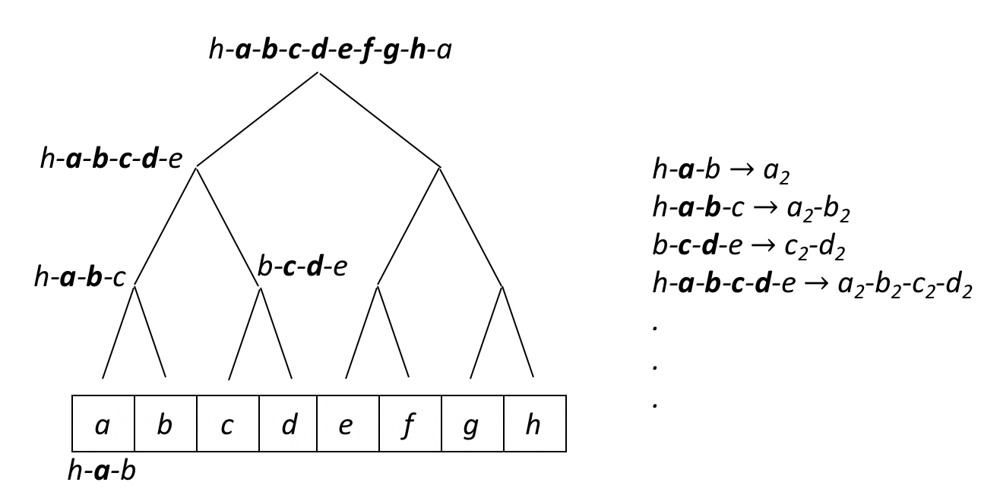

Working with Cellular Automata
------------------------------

A First Example
~~~~~~~~~~~~~~~

The following example illustrates the evolution of the Rule 30 CA, described in `A New Kind of Science`, as implemented
with CellPyLib:

.. code-block::

    import cellpylib as cpl

    cellular_automaton = cpl.init_simple(200)

    cellular_automaton = cpl.evolve(cellular_automaton, timesteps=100, memoize=True,
                                    apply_rule=lambda n, c, t: cpl.nks_rule(n, 30))

The initial conditions are instantiated using the function :py:func:`~cellpylib.ca_functions.init_simple`, which, in
this example, creates a 200-dimensional vector consisting of zeroes, except for the component in the center of the
vector, which is initialized with a value of 1. Next, the system is subjected to evolution by calling the
:py:func:`~cellpylib.ca_functions.evolve` function. The system evolves under the rule specified through the
``apply_rule`` parameter. Any function that accepts the three arguments ``n``, ``c`` and ``t`` can be supplied as a
rule, but in this case the built-in function :py:func:`~cellpylib.ca_functions.nks_rule` is invoked to provide Rule 30.
The CA is evolved for 100 ``timesteps``, or 100 applications of the rule to the initial and subsequent conditions.

During each timestep, the function supplied to ``apply_rule`` is invoked for each cell. The ``n`` argument refers to the
neighbourhood of the current cell, and consists of an array (in the 1-dimensional CA case) of the activities (i.e.
states) of the cells comprising the current cell's neighbourhood (an array with length 3, in the case of a 1-dimensional
CA with radius of 1). The ``c`` argument refers to index of the cell under consideration. It serves as a label
identifying the current cell. The ``t`` argument is an integer specifying the current timestep.

Finally, to visualize the results, the :py:func:`~cellpylib.ca_functions.plot` function can be utilized:

.. code-block::

    cpl.plot(cellular_automaton)

.. image:: _static/rule30.png
    :width: 400

How CA are represented
~~~~~~~~~~~~~~~~~~~~~~

In CellPyLib, a CA is an array containing the states of the system at each timestep. The initial state is found at index
0 in the array (and also represents the first timestep), the result of the second timestep is at index 1 in the array,
and so on. A state is represented as an array for 1-dimensional CA, and as an array of arrays for 2-dimensional CA.

.. code-block::

    # An example of a 1D binary CA with 10 cells evolved for 3 timesteps
    [
        [0, 0, 0, 0, 0, 1, 0, 0, 0, 0],  # 1st timestep (initial conditions)
        [0, 0, 0, 0, 1, 0, 1, 0, 0, 0],  # 2st timestep
        [0, 0, 0, 1, 0, 1, 0, 1, 0, 0]   # 3rd timestep
    ]

Initializing CA
~~~~~~~~~~~~~~~~~

A CA is initialized by simply instantiating an array of an array (for 1-dimensional CA), or an array of an array of an
array (for 2-dimensional CA). This will represent the initial conditions of the system, which can be submitted to the
:py:func:`~cellpylib.ca_functions.evolve` function. For convenience, there are several built-in functions for common CA
initializations. For example, the :py:func:`~cellpylib.ca_functions.init_simple` function can be used to create a 1D
binary initialization with a 1 in the center:

.. code-block::

    import cellpylib as cpl
    cellular_automaton = cpl.init_simple(10)
    print(cellular_automaton)
    # [[0 0 0 0 0 1 0 0 0 0]]

An analogous function, :py:func:`~cellpylib.ca_functions2d.init_simple2d`, exists for 2-dimensional CA.

There are built-in functions for initializing CA randomly as well, in the :py:func:`~cellpylib.ca_functions.init_random`
and :py:func:`~cellpylib.ca_functions2d.init_random2d` functions.

Evolving CA
~~~~~~~~~~~~~

CA are evolved with the :py:func:`~cellpylib.ca_functions.evolve` function (for 1-dimensional CA) and the
:py:func:`~cellpylib.ca_functions2d.evolve2d` function (for 2-dimensional CA). The
:py:func:`~cellpylib.ca_functions.evolve` function requires 4 parameters: ``cellular_automaton``, ``timesteps``,
``apply_rule`` and ``r``.

The ``cellular_automaton`` parameter represents the CA consisting of initial conditions. For example, for a 1D CA, a
valid argument could be `[[0,0,0,0,1,0,0,0,0]]`. The initial conditions can include a history of previous states. Thus,
if the length of the array is greater than 1, then the last item in the array will be used as the initial conditions for
the current evolution, and the final CA will include the history supplied. For example, for a 1D CA, a valid argument
that includes a history of previous states could be `[[0,0,0,0,0,0,0,0,0], [0,0,0,0,1,0,0,0,0]]`, and
`[0,0,0,0,1,0,0,0,0]` would be used as the initial state for the evolution.

The ``timesteps`` parameter is simply an integer representing the number of timesteps the CA should undergo evolution, or
application of the supplied rule. Note that the initial conditions of the CA are considered the 1st timestep, so, for
example, if ``timesteps`` is set to `3`, then the rule will be applied two times. This assumes that the number of
timesteps is known in advance. However, in some cases, the number of timesteps may not be known in advance, and the CA
is meant to be evolved until a certain condition is met. For such scenarios, the ``timesteps`` parameter may alternatively
be a callable that accepts the states of the CA over the course of its evolution and the current timestep number, and is
expected to return a boolean indicating whether evolution should continue. If the callable returns `False`, then
evolution is halted.

The ``apply_rule`` parameter expects a callable that represents the rule that will be applied to each cell of the CA at
each timestep. Any kind of callable is valid, but the callable must accept 3 arguments: ``n``, ``c`` and ``t``.
Furthermore, the callable must return the state of the current cell at the next timestep. The `n` argument is the
neighbourhood, which is a NumPy array of length `2r + 1` representing the state of the neighbourhood of the cell (for
1D CA), where ``r`` is the neighbourhood radius. The state of the current cell will always be located at the "center" of
the neighbourhood. The ``c`` argument is the cell identity, which is a scalar representing the index of the cell in the
cellular automaton array. Finally, the ``t`` argument is an integer representing the time step in the evolution.

The ``r`` parameter is simply an integer that represents the radius of the neighbourhood of the CA. For 1D CA, a radius
of 1 implies a neighbourhood is of size 3, a radius of 2 implies a neighbourhood of size 5, and so on. For 2D CA, the
same idea applies, but the neighbourhood will have the dimensions `2r+1 x 2r+1` (with a slight adjustment for von
Neumann neighbourhoods).

Visualizing CA
~~~~~~~~~~~~~~

There are a number of built-in functions to help visualize CA. The simplest is perhaps the
:py:func:`~cellpylib.ca_functions.plot` function, which plots the evolution of a 1D CA. There is also the
:py:func:`~cellpylib.ca_functions.plot_multiple` function, which will create plots for multiple CA in the same
invocation. For 2D CA, there is the :py:func:`~cellpylib.ca_functions2d.plot2d` function. This function accepts an
additional argument, ``timestep``, which represents the particular timestep to be plotted. If none is given, then the
state at the last timestep will be plotted. Finally, the evolution of 2D CA can be animated, with the
:py:func:`~cellpylib.ca_functions2d.plot2d_animate` function.

Increasing Execution Speed with Memoization
~~~~~~~~~~~~~~~~~~~~~~~~~~~~~~~~~~~~~~~~~~~

Memoization is a means by which computer programs can be made to execute faster. It involves caching the result of a
function for a given input. CellPyLib supports the memoization of rules supplied to the
:py:func:`~cellpylib.ca_functions.evolve` and :py:func:`~cellpylib.ca_functions2d.evolve2d` functions. By default,
memoization is not enabled, since only rules that do not depend on the cell index value, the timestep number, or that
do not store any state as a result of invoking the rule, are supported for memoization. Only the cell neighbourhood is
used to index the output of the rule. Memoization must be explicitly enabled by passing along the ``memoize`` parameter
with a value of `True` when invoking the :py:func:`~cellpylib.ca_functions.evolve` and
:py:func:`~cellpylib.ca_functions2d.evolve2d` functions.

Memoization is expected to provide an increase to execution speed when there is some overhead involved when invoking
the rule. Again, only stateless rules that depend only on the cell neighbourhood are supported. Consider the following
example of rule 30, where memoization is enabled in one case:

.. code-block::

    import cellpylib as cpl
    import time

    start = time.time()
    cpl.evolve(cpl.init_simple(600), timesteps=300,
               apply_rule=lambda n, c, t: cpl.nks_rule(n, 30))
    print(f"Without memoization: {time.time() - start:.2f} seconds elapsed")

    start = time.time()
    cpl.evolve(cpl.init_simple(600), timesteps=300,
               apply_rule=lambda n, c, t: cpl.nks_rule(n, 30), memoize=True)
    print(f"With memoization: {time.time() - start:.2f} seconds elapsed")

The program above prints:

.. code-block::

    Without memoization: 8.23 seconds elapsed
    With memoization: 0.12 seconds elapsed

*(results may differ, depending on the device used)*

**Using Binary Trees and Quadtrees to Exploit Regularities**

To provide a further speed improvement, memoization can be combined with recursive structures, such as binary trees and
quadtrees. This approach is heavily inspired by the well-known
`HashLife algorithm <https://en.wikipedia.org/wiki/Hashlife>`_ for fast cellular automata simulation, which also
combines memoization with quadtrees.

Although CellPyLib does not provide an implementation of HashLife, it does provide an option to sub-divide a finite grid
into halves or quadrants, and apply memoization at various levels of the resulting binary tree or quadtree. This results
in a significant speed-up when there are repetitive and regular patterns in the CA. To combine memoization with tree
structures in CellPyLib, provide the ``memoize`` option with a value of `"recursive"` when calling the
:py:func:`~cellpylib.ca_functions.evolve` and :py:func:`~cellpylib.ca_functions2d.evolve2d` functions. The following
code snippets provide an example:

.. code-block::

    import cellpylib as cpl

    cpl.evolve(cpl.init_simple(600), timesteps=300,
               apply_rule=lambda n, c, t: cpl.nks_rule(n, 30), memoize="recursive")

And for the 2D case:

.. code-block::

    import cellpylib as cpl

    cpl.evolve2d(ca, timesteps=60, neighbourhood="Moore",
                 apply_rule=cpl.game_of_life_rule, memoize="recursive")

Note that, as is the case when using regular memoization (by providing the ``memoize`` option with `True`), only
stateless rules that do not depend on the cell index or timestep number are supported when supplying the ``memoize``
option with a value of `"recursive"`. Also, only CA that exhibit regular and repetitive patterns will demonstrate a
significant decrease in execution times. Finally, 1D CA that have :math:`2^k` cells, or 2D CA that have
:math:`2^k \times 2^k` cells, should result in lower running times when `"recursive"` is used.

To illustrate the operation of this algorithm, consider the following diagram, in which a 1D Elementary CA (radius 1) is
organized into a binary tree:

There are 8 cells, which are annotated with the letters `a` through `h`. Each node in the binary tree represents the
neighbourhood of one or more contiguous cells. At the bottom of the tree, the leaves are simply the neighbourhoods of
each cell. For example, one node represents `h-a-b`, the neighbourhood for cell `a`. At progressively higher levels of
the tree, each node represents wider neighbourhoods encompassing more cells. The list on the right of the tree
represents the memoization mapping from each neighbourhood to the subsequent values of the cells in question. In this
example, the memoization cache would contain an entry indexed by a state of the neighbourhood `h-a-b` and its associated
value for `a` in the next timestep, as given by the CA rule being used. The idea is to start, at each timestep, from the
root of the tree, looking in the cache for existing states that correspond to the neighbourhoods in the tree, and
updating the values of the cells represented by a node/neighbourhood if an entry exists in the cache. This should result
in an increase in execution speed, since the children of a node needn't be visited if a state was found in the cache.
CA that exhibit regular and repetitive patterns will benefit the most from this approach. CA that exhibit much less
regularity (e.g. ECA Rule 30), will not benefit from this approach, and may in fact incur a performance penalty. In
such a case, it might be best to use a regular memoization scheme (by providing the ``memoize`` option with `True`). For
2D CA, the same concept applies, with the difference that the cells are divided at each level into quandrants rather
than halves, forming a quadtree.

The following table illustrates the running times for 1D CA using various ``memoize`` options:

.. list-table:: Comparison of running times (in seconds) for 1D ECA (1000 timesteps)
   :widths: 25 25 25 25 25
   :header-rows: 1

   * - ECA Rule #
     - `memoize=True`
     - `memoize="recursive"`
     - `memoize=False`
     - # cells
   * - 30
     - 0.74
     - 2.45
     - 47.54
     - 1024
   * - 4
     - 0.63
     - 0.21
     - 44.73
     - 1024
   * - 2
     - 0.81
     - 0.29
     - 46.37
     - 1024
   * - 110
     - 0.66
     - 0.71
     - 50.98
     - 1024
   * - 30
     - 0.73
     - 2.75
     - \-
     - 1000
   * - 4
     - 0.65
     - 0.19
     - \-
     - 1000
   * - 2
     - 0.70
     - 0.28
     - \-
     - 1000
   * - 110
     - 0.64
     - 0.93
     - \-
     - 1000

The following table illustrates the running times for 2D CA using various ``memoize`` options:

.. list-table:: Comparison of running times (in seconds) for 2D CA (700 timesteps)
   :widths: 25 25 25 25 25
   :header-rows: 1

   * - CA
     - `memoize=True`
     - `memoize="recursive"`
     - `memoize=False`
     - # cells
   * - SDSR Loop
     - 117.89
     - 13.86
     - 220.54
     - 100x100
   * - SDSR Loop
     - 165.74
     - 15.76
     - 371.05
     - 128x128
   * - SDSR Loop
     - \-
     - 36.30
     - \-
     - 256x256
   * - Game of Life
     - 39.39
     - 1.74
     - 64.90
     - 60x60
   * - Game of Life
     - 43.62
     - 1.41
     - 68.72
     - 64x64
   * - Game of Life
     - \-
     - 5.14
     - \-
     - 128x128
